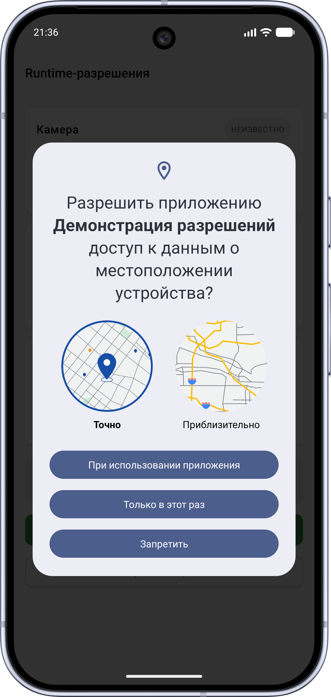
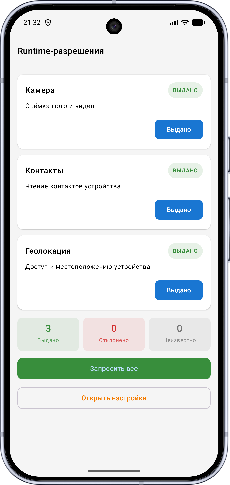
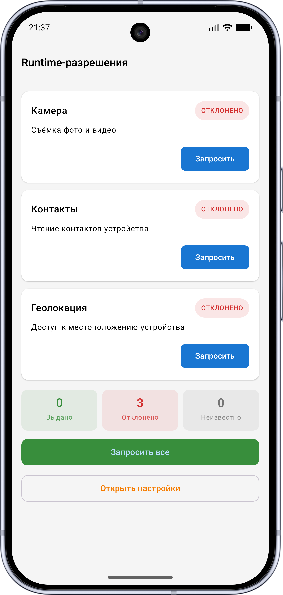
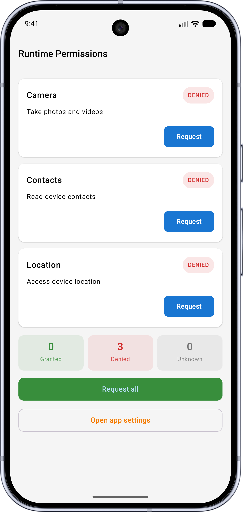
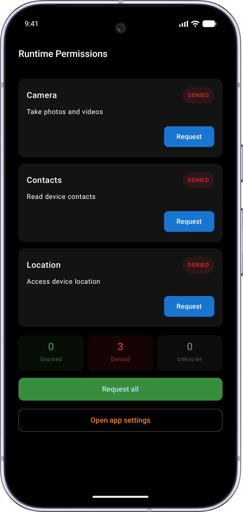
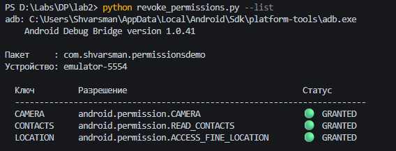

# Работа с правами доступа

Демонстрационное Android-приложение для работы с runtime-разрешениями (Android API 23+).  
Скрипт для управления разрешениями через ADB с хоста.

## Скриншоты

| Главный экран | Запрос разрешения | Статус выдан |
|:---:|:---:|:---:|
|  |  |  |
| Статус отклонен | Локализация | Темная тема |
|  |  |  |

---

## Возможности

- Запрос runtime-разрешений без запроса при установке
- Отображение статуса каждого разрешения: **UNKNOWN / DENIED / GRANTED**
- Поддержка 3 разрешений: камера, контакты, геолокация
- Кнопка перехода в системные настройки для ручного снятия разрешений
- Python-скрипт для снятия/выдачи разрешений через ADB с хост-машины
- Поддержка русского и английского языков (следует языку системы)

---

## Требования

- Android 6.0+ (API level 23+)
- Android Studio Hedgehog или новее
- Python 3.10+ (для ADB-скрипта)
- ADB из Android SDK Platform Tools

---

## Установка и запуск

### 1. Клонировать репозиторий

```bash
git clone https://github.com/Shvarsman/PermissionsDemo.git
cd PermissionsDemo
```

### 2. Открыть в Android Studio

```
File → Open → выбрать папку проекта
```

### 3. Запустить на устройстве или эмуляторе

```
Run → Run 'app'
```

---

## ADB-скрипт

Скрипт `revoke_permissions.py` позволяет управлять разрешениями приложения с хост-машины без UI.

### Предварительная настройка ADB

**Windows (PowerShell):**
```powershell
$adbPath = "$env:LOCALAPPDATA\Android\Sdk\platform-tools"
[Environment]::SetEnvironmentVariable("PATH", $env:PATH + ";$adbPath", "User")
```
Перезапустить терминал, затем проверить:
```powershell
adb version
```

**macOS / Linux:**
```bash
export PATH="$PATH:$HOME/Library/Android/sdk/platform-tools"   # macOS
export PATH="$PATH:$HOME/Android/Sdk/platform-tools"           # Linux
```

### Использование скрипта

```bash
# Показать статусы всех разрешений
python revoke_permissions.py --list

# Снять все разрешения
python revoke_permissions.py --revoke

# Снять одно разрешение
python revoke_permissions.py --revoke --permission CAMERA

# Выдать все разрешения
python revoke_permissions.py --grant

# Выдать одно разрешение
python revoke_permissions.py --grant --permission LOCATION

# Несколько подключённых устройств
python revoke_permissions.py --list --device emulator-5554
```

### Пример вывода



```
    adb: C:\...\platform-tools\adb.exe
    Android Debug Bridge version 1.0.41

  Пакет     : com.shvarsman.permissionsdemo
  Устройство: R3CX109ABCD

  Ключ         Разрешение                                    Статус
  ------------------------------------------------------------------------
  CAMERA       android.permission.CAMERA                     🟢  GRANTED
  CONTACTS     android.permission.READ_CONTACTS              🔴  DENIED
  LOCATION     android.permission.ACCESS_FINE_LOCATION       ⚪  UNKNOWN
```

---

## Разрешения

| Ключ | Разрешение | Описание |
|------|-----------|----------|
| `CAMERA` | `android.permission.CAMERA` | Съёмка фото и видео |
| `CONTACTS` | `android.permission.READ_CONTACTS` | Чтение контактов |
| `LOCATION` | `android.permission.ACCESS_FINE_LOCATION` | Геолокация |

---

## Как добавить новое разрешение

1. Добавить `<uses-permission>` в `AndroidManifest.xml`
2. Добавить строки в `res/values/strings.xml` и `res/values-ru/strings.xml`
3. Добавить запись в список `buildInitialList()` в `PermissionsViewModel.kt`
4. Добавить запись в словарь `PERMISSIONS` в `revoke_permissions.py`
